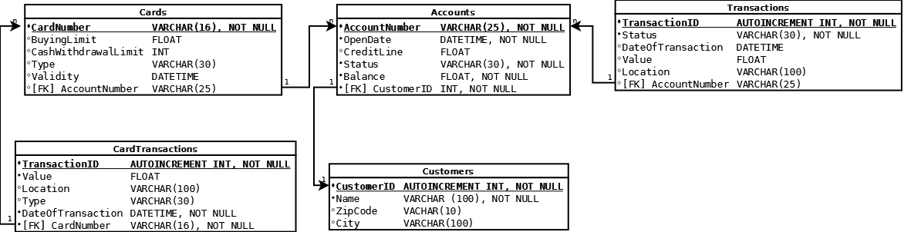

Given the following relational database structure. The exam must be solved on this schema.

----------

There is a simple mini bank database structure.
There are customers who can have only one account.
They can own card for the account which can be creditcard or bank card.
Transactions can execute directly from the account or via the card.
Your task is to create the correct structure for it.

----------

Attachments:  
[*01_customers.sql*](description/01_customers.sql)  
[*02_accounts.sql*](description/02_accounts.sql)  
[*03_transactions.sql*](description/03_transactions.sql)  
[*04_cards.sql*](description/04_cards.sql)  
[*05_cardtransactions.sql*](description/05_cardtransactions.sql)
